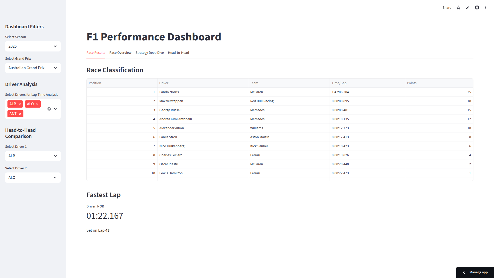
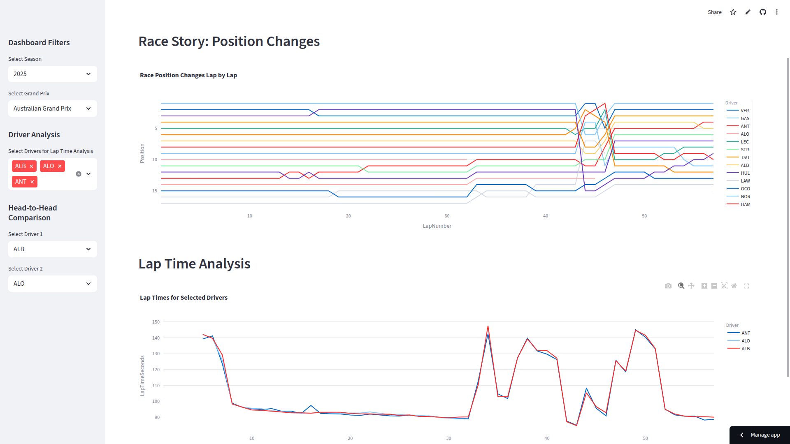
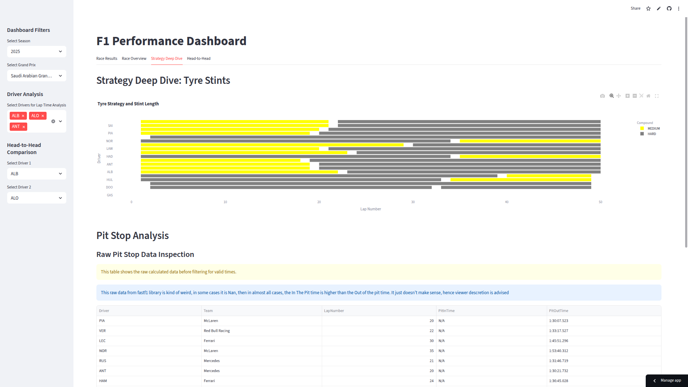
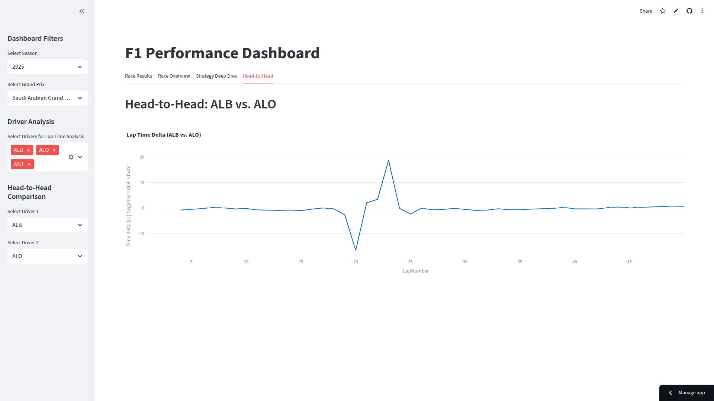

# 🏎️ F1 Race Strategy & Performance Analytics Dashboard

An interactive web application built with Streamlit to analyze and visualize Formula 1 race data. This dashboard provides a comprehensive overview of race results, driver performance, and team strategies for any Grand Prix from recent seasons.

🚀 Live Demo[
Access the Dashboard Here!](https://f1-performance-analytics.streamlit.app/)

📸 Screenshots
<table>
  <tr>
    <td align="center">
      
       
      1
    </td>
    <td align="center">
      
       
      2
    </td>
  </tr>
</table>

<table>
  <tr>
    <td align="center">
      
       
      3
    </td>
    <td align="center">
      
       
      4
    </td>
  </tr>
</table>

## ✨ Features

🏆 Race Results: View the final race classification, points distribution for each driver, and the fastest lap of the race with the driver's name and time.

### 📊 Race Overview:

Position Changes: A dynamic "worm chart" tracking the lap-by-lap position changes for every driver.

Lap Time Analysis: Compare lap times for a custom selection of drivers on an interactive line chart.

### ⚙️ Strategy Deep Dive:

Tyre Strategy: A Gantt chart visualizing the tyre compound and stint length for every driver.

Pit Stop Analysis: A box plot comparing the distribution of pit stop durations for all teams.

### ⚔️ Head-to-Head:

Directly compare the race pace of any two drivers.

View a lap-by-lap time delta chart to see who was faster at different stages of the race.

📅 Dynamic Filters: Use the sidebar to select any season and any completed race from the past several years.

## Usage
Once the app is running, use the sidebar to select a season and a Grand Prix. The dashboard will load the data and display the analysis across the different tabs. You can use the other sidebar options to compare specific drivers for the lap time and head-to-head analyses.

## 🛠️ Tech Stack

### Language: Python

### Framework: Streamlit

### Libraries:

fastf1 for F1 data access

pandas for data manipulation

## Data Source
This project is powered by the excellent FastF1 library, which sources its data from the official F1 live timing APIs.
plotly for interactive visualizations

